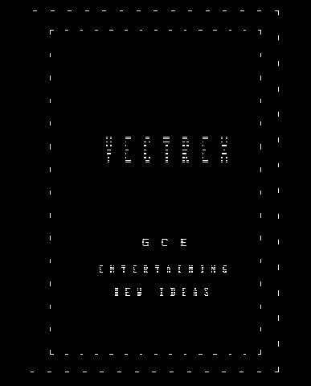
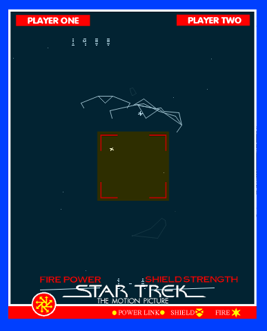

vecx
====

 

Requirements
------------
* `libsdl`
* `sdl_gfx`

Usage
-----

Authors
-------

* Valavan Manohararajah - original author
* [John Hawthorn](https://twitter.com/jhawthorn) - SDL port
* [Nikita Zimin](https://twitter.com/nzeemin) - audio

Contributors
-------
* [Simon Rodriguez](https://twitter.com/simonkosua) - SDL2 port

